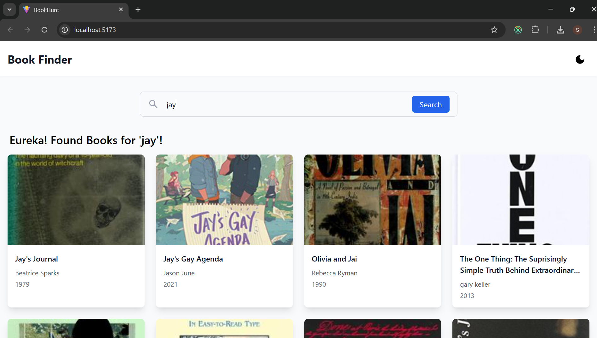

<div align="center">
  <h1 style="font-size: 3em;"><strong>Book Finder APP</strong></h1>
</div>

## _About the Project_

Book Finder is a React application that allows users to search for books by their name or by patterns within the name. The app fetches book details from an external API, making it easy for users to find the books they're looking for quickly and efficiently.

## _Features_

- 🔍 Search for books by title or partial patterns.
- 📚 View detailed information about books, including title and author.
- ⚡ Fast and responsive user interface.

## _Technologies Used_

- _Frontend:_ React, React Router, React vite
- _Styling:_ CSS/Tailwind CSS
- _API Integration:_ Fetch API / Axios

## _Installation_

To get started with Book Finder, follow these steps:

1. _Clone the repository:_
   bash
   git clone https://github.com/yourusername/book-finder.git
   cd Bookfinder-app
2. **Install dependencies:**
   bash
   npm install
3. _Run the project:_
   ```bash
   npm start
   The application will be available at http://localhost:5173.
   ```

# _Usage_

- Open the application in your browser.
- Enter a book name or part of a book name in the search bar.
- Browse through the search results to find your desired book.

# _Sample output_



# _API_

- This application uses the Public Books API to fetch book data.

# Contact

For any queries, feel free to reach out:
📧 Email: jayaramjakka9999@gmail.com
